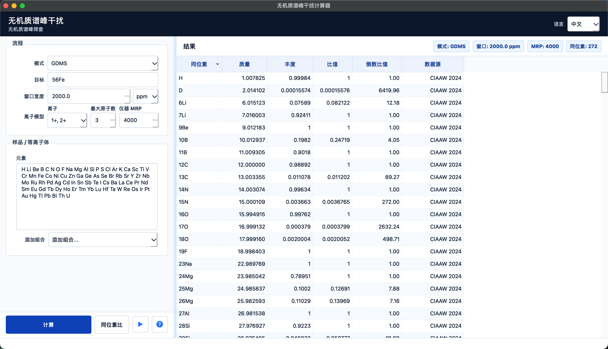
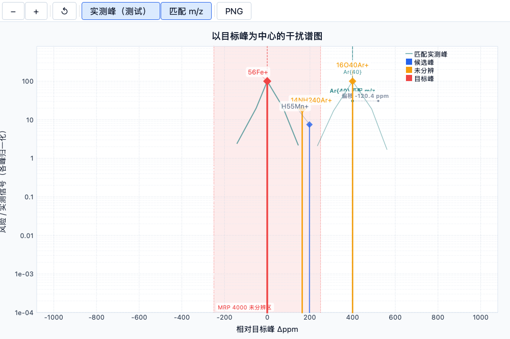
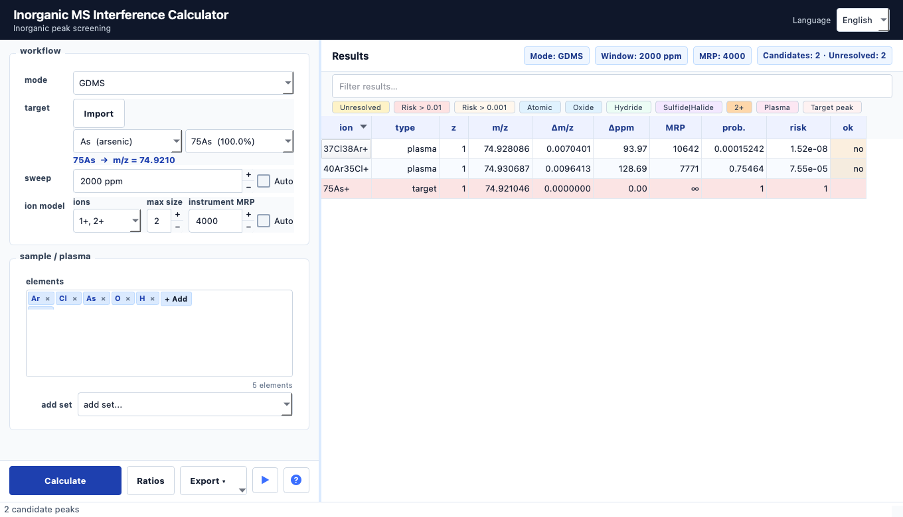
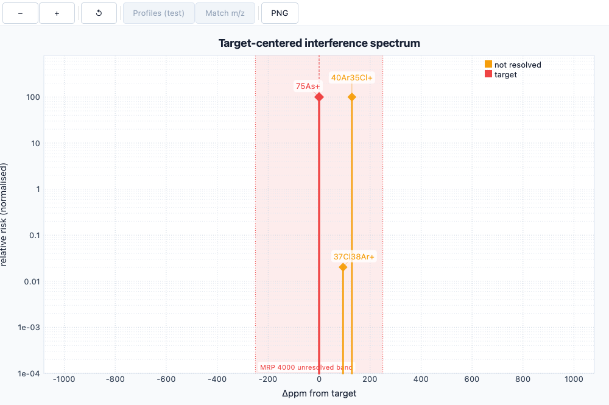

.. _chinese-section:

============================================================
无机质谱峰干扰计算器 / Inorganic MS Interference Calculator 2.8
============================================================

`English <english-section_>`_ | **中文**

**Gitee 同步版说明**：当前页面面向
`Gitee 仓库 <https://gitee.com/tyongs/interference_calculator>`_。Gitee
用于国内代码访问、源码安装和分支同步；Windows / macOS 免安装包仍由
GitHub Actions 自动构建，并发布在
`GitHub Releases <https://github.com/Tingfe/interference_calculator/releases>`_。
因此本 README 会区分“当前 Gitee 仓库”和“GitHub 自动发布入口”，避免两个仓库的发布职责混淆。

**无机质谱峰干扰计算器** 是一款用于质谱峰干扰筛查的科学桌面工具。当前 ``main`` 分支是面向 GDMS、ICP-MS 和 SIMS 的无机材料专用工具；``maintenance/original`` 是已经现代化维护过的通用扫描分支，保留原作者通用元素 / 同位素组合扫描和同位素比功能，同时继续使用更新后的数据、依赖和打包流程。

该应用整合了双语 PyQt 界面、以 GDMS 优先的默认设置、基于模板的无机干扰生成、CIAAW 2024 / AME2020 同位素数据、以 ``ppm`` 表示的完整窗口宽度、以目标峰为中心的交互式谱图，以及紧凑高效的干扰结果表格。

2.8 版更新内容
--------------

v2.8.0 重点增强样品相关的动态干扰判断：

* **样品画像先验**：计算时可选择材料画像，把基体、主要成分、痕量杂质、
  背景气体和等离子体来源纳入干扰风险排序。
* **内置常见材料体系**：包含高纯 Al/Cu/Fe/Ni/Ti/Si/Mg、铝合金、不锈钢、
  镍基合金、铜基合金、硅酸盐玻璃、石墨/碳材料等 13 类画像。
* **更透明的风险输出**：启用样品画像后，结果会显示样品先验、未加权风险、
  预期相对强度和风险依据，便于判断干扰峰是否符合当前样品背景。
* **GUI 直接选择画像**：主界面新增样品画像下拉框，未选择时保持原有计算逻辑。
* **可扩展实验室经验库**：公共 API 支持传入自定义 ``sample_profile`` dict，
  便于把实际样品体系和内部经验逐步沉淀到筛查模型中。

2.7 版更新内容
--------------

v2.7.0 是一次面向核心计算性能和发布质量的稳定化发布：

* **核心算法向量化重写**：``interference()`` 使用 NumPy 批量枚举和质量计算，
  避免对每个候选结果重复调用 ``Molecule()`` / pyparsing 解析。
* **CPU 即可获得大幅加速**：典型基准中 ``maxsize=2`` 至 ``maxsize=5`` 分别取得
  约 43.8x、30.7x、7.0x 和 2.2x 加速，不再依赖未实现的 GPU 路径。
* **API 向后兼容**：``use_pruning``、``n_workers`` 和 ``use_streaming`` 参数仍可
  接收，但 2.7 的向量化路径已经不再依赖这些旧优化开关。
* **代码质量修复**：清理循环导入、可变默认参数、弃用 API warning 和若干静默异常，
  提升调试可见性。
* **发布说明同步**：2.7 的中英文变更记录位于 ``CHANGELOG.md``，GitHub Release 会
  自动提取对应版本段落。

2.6 版更新内容
--------------

v2.6.0 是一次全面优化发布，包含性能、架构、质量、文档和现代化改造的重大升级：

* **性能提升 2.9 倍**：预过滤剪枝算法在生成组合前提前排除无效同位素，并行计算支持多核加速。
* **内存降低 50%**：生成器模式和流式处理架构减少峰值内存占用，float32 数据类型优化进一步节省内存。
* **UI 组件模块化**：提取 6 个独立 UI 组件（TableModel、TableView、ElementInput 等），提高代码可维护性。
* **配置持久化系统**：JSON 存储用户偏好，支持命名预设管理、导入导出功能和最近目标峰追踪。
* **插件系统框架**：YAML 配置插件机制，内置增强导出和自定义规则两个示例插件，支持热重载。
* **测试覆盖增强**：新增 84+ 单元测试，性能基准测试套件，边界情况全覆盖。
* **结构化日志系统**：5 个日志级别，错误跟踪和诊断信息，JSON 诊断报告导出。
* **API 文档完善**：Sphinx 自动生成 HTML 文档，Google 风格 docstrings，完整类型注解。
* **用户手册扩展**：从 234 行扩展到 378 行，新增插件、日志、性能 3 个章节，FAQ 扩展到 14 个问题。
* **国际化支持**：运行时在英语和中文之间切换。
* **Poetry 构建系统**：完整的 pyproject.toml 配置，依赖分组管理，保持 pip 向后兼容。
* **CI/CD 优化**：5 个增强工作流，12 种 Python/OS 组合测试，自动化代码质量检查，Dependabot 集成。

2.5 版更新内容
--------------

2.x 是一次重大迭代，2.5 版在 2.1 的无机质谱主线基础上完成了 GDMS
谱图 / TRR / GDR 原始文件导入、目标峰选择、发布打包和启动体验的里程碑升级：

* 现代化科学工具 GUI：更清晰的控制面板、结果概览标签、空状态提示、更紧凑的表格布局，并支持中英文界面切换。
* GDMS、ICP-MS 和 SIMS 预设：提供电荷态、目标窗口、风险模型和仪器质量分辨力（MRP）的实用默认值；导入目标峰存在有效 ``FWHM`` 时，可按 ``observed m/z / FWHM`` 自动估算 MRP。
* GDMS 谱图导入：支持 Excel 谱图导出、实验性的 GD90Trace ``.TRR`` 原始文件和 Elsima ``.GDR`` 原始文件导入，自动读取 ``Fe{56}`` 这类同位素谱图，填充元素列表，并提供实测目标峰选择；导入目标峰列表显示同位素天然丰度，m/z 详情显示在下方。多 Run 原始文件会先选择 Run，并标记同位素集合异常的 Run。导入的 ``Mass`` / ``Values`` 或原始文件 ``Mass`` / ``Current`` 点可通过默认关闭的实验开关在谱图中叠加为真实峰形，也可按理论同位素 ``m/z`` 进行可选显示对齐。
* 常用无机元素集：包含适用于无机质谱筛查的全元素集。
* GDMS 默认目标窗口为 ``2000 ppm``（全窗口宽度），等同于目标峰校准后 ``±1000 ppm`` 的范围；导入目标峰有有效 ``Mass`` 点列时，可按真实数据范围自动估算完整 ppm 窗口。
* 新的无机质谱算法：基于干扰模板生成原子离子、双电荷离子、氧化物、氢化物、氢氧化物、氮化物、碳化物、硫化物、卤化物、等离子体加合物、背景分子及小型基质团簇的干扰。
* ``相对风险`` 排序：基于同位素概率和特定方法的形成因子进行评估，用于筛查排序而非定量校正。
* 目标峰中心交互式谱图：存在目标峰时显示 ``Δppm`` 分布，支持可选的导入 GDMS 真实峰形叠加（测试功能，默认关闭）、实测峰到理论 ``m/z`` 的显示匹配、峰悬停详情、点击联动表格、仪器 MRP 未分辨区显示和 PNG 导出。
* 同位素数据库更新：基于 CIAAW 2024 同位素丰度和 AME2020 原子质量生成，包含不确定度和丰度范围元数据。
* Python 3 现代化改造，并为核心分子解析、干扰搜索、无机筛查、双语覆盖和数据模式编写了单元测试。

项目信息
--------

当前版本：``2.8.2``

原作者：Zan Peeters

当前维护者及最新贡献者：Tingfe

当前仓库（Gitee）：https://gitee.com/tyongs/interference_calculator

自动发布仓库（GitHub）：https://github.com/Tingfe/interference_calculator

开发状态
--------

.. image:: https://img.shields.io/badge/Project_Board-Optimization_Roadmap-blue
   :target: https://github.com/Tingfe/interference_calculator/projects/1
   :alt: Project Board

.. image:: https://img.shields.io/github/issues-pr/Tingfe/interference_calculator
   :target: https://github.com/Tingfe/interference_calculator/pulls
   :alt: Pull Requests

.. image:: https://img.shields.io/github/contributors/Tingfe/interference_calculator
   :target: https://github.com/Tingfe/interference_calculator/graphs/contributors
   :alt: Contributors

当前开发重点：**Optimization Roadmap 2026** (v2.8.0 样品画像与动态干扰风险)

查看项目进展: `Project Board <https://github.com/Tingfe/interference_calculator/projects/1>`_

贡献指南
~~~~~~~~

欢迎贡献！请参考：

- `优化路线图 <docs/OPTIMIZATION_ROADMAP.md>`_: 了解未来开发计划
- `Project Board <https://github.com/Tingfe/interference_calculator/projects/1>`_: 查看正在进行的任务
- `分支模型 <docs/BRANCHING.md>`_: 了解如何提交代码
- `发布指南 <docs/RELEASE.md>`_: 了解版本发布流程

**如何开始贡献**:

1. 浏览 `Project Board <https://github.com/Tingfe/interference_calculator/projects/1>`_ 寻找 ``good first issue`` 标签的任务
2. Fork 仓库并创建特性分支
3. 提交PR并关联相关Issue
4. 等待代码审查和合并

安装
----

**方式一：免安装版（推荐，无需 Python）**

免安装版本由 GitHub Actions 构建，请从
`GitHub Releases <https://github.com/Tingfe/interference_calculator/releases>`_
下载对应平台的安装包后直接运行：

- **Windows**：下载 ``InterferenceCalculator-Windows-*.zip``，解压后双击
  ``InterferenceCalculator.exe``。Windows 采用目录版打包，避免单文件 ``.exe``
  每次启动前解压运行时导致长时间无响应。
  如果旧版 Windows 提示缺少 ``api-ms-win-core-path-l1-1-0.dll``，请改用同一
  Release 中的 ``InterferenceCalculator-Windows-legacy-*.zip``。
- **macOS**：下载 ``InterferenceCalculator-macOS-*.dmg``，打开后将应用拖入 ``Applications`` 文件夹，首次打开需在「安全性与隐私」中允许。

**方式二：通过 PyPI 安装（需要 Python 3.9+）**

.. code-block:: bash

   pip install interference_calculator

GDMS Excel 导入和 Excel 导出所需的 ``openpyxl`` 已包含在默认依赖中；
实验性 TRR / GDR 原始文件导入不需要额外运行时依赖。

也可从 `GitHub Releases <https://github.com/Tingfe/interference_calculator/releases>`_
下载 wheel 包手动安装：

.. code-block:: bash

   pip install interference_calculator-*.whl

**方式三：从源码安装（开发者）**

.. code-block:: bash

   git clone https://gitee.com/tyongs/interference_calculator.git
   cd interference_calculator
   python3 -m venv .venv
   . .venv/bin/activate
   pip install -e .

启动界面
--------

- **免安装版**：Windows 解压 ``.zip`` 后双击 ``InterferenceCalculator.exe``；
  macOS 打开 ``.dmg`` 后点击应用。
- **PyPI 安装版**：在终端中运行 ``interference_calculator`` 即可启动图形界面。
- **源码运行**：在项目根目录运行 ``python -m interference_calculator.ui``；直接运行
  ``python interference_calculator/ui.py`` 也受支持。

GDMS 快速工作流
---------------

1. 选择 ``GDMS`` 模式。
2. 如有 GDMS 导出的 Excel 谱图文件、GD90Trace ``.TRR`` 原始文件或 Elsima ``.GDR`` 原始文件，点击 **导入**，软件会自动提取文件中的元素和可选目标峰；多 Run 原始文件会先让用户选择 Run。
3. 导入后优先从目标峰列表选择；列表会显示同位素天然丰度，理论和实测 m/z 会在下方详情中显示。只有目标不在导入文件中时，勾选 **手动目标** 再选择 ``75As``、``56Fe`` 等目标。
4. 保持默认 ``2000 ppm`` 全窗口；导入目标峰有有效 ``Mass`` 点列时，可勾选扫描窗口旁边的 ``自动``。
5. 导入文件后，``添加组合`` 会出现 ``导入元素`` 预设；组合选择只会追加当前缺失的元素，因此可在保留导入样品元素的同时补充 Ar 背景、轻元素背景、卤素 / 硫或基体元素。
6. 如未导入文件，点击元素区的 **添加** 按钮选择样品、基质、等离子体及背景元素，例如 ``Ar Cl As O H``，或添加全元素无机预设进行广泛筛查。
7. 根据需要设置离子模型和仪器 MRP；导入目标峰有有效 ``FWHM`` 时，可勾选 MRP 旁边的 ``自动``。
8. 点击 **计算**。
9. 查阅候选峰、``Δppm``、所需 MRP、相对风险及每个峰是否可分辨。
10. 打开谱图视图查看以目标峰为中心的峰分布；已导入 GDMS 谱图或 TRR 文件时，可在谱图工具栏手动打开 ``实测峰（测试）`` 叠加真实峰形，必要时再打开 ``匹配 m/z`` 将每条实测峰中心对齐到理论同位素 ``m/z``。``匹配 m/z`` 会自动打开实测峰叠加，并显示对齐参考线和偏移量标签；悬停峰可看详情，点击峰可定位表格行。

导入目标峰时，``谱图质心`` / ``谱图峰顶`` 是实测峰形摘要：Excel 导入会从 ``Mass`` / ``Values``
点计算得到，TRR / GDR 导入会优先使用原始文件保存的 ``m_CentroidMassValue`` 作为 observed 位置；``Δm/z``、``Δppm``、MRP 和谱图中心始终相对理论目标
``m/z`` 计算。真实谱图曲线默认会先用所选目标峰的谱图质心 / 峰顶做零点对齐，再绘制到同一个目标居中横轴上，避免把理论候选峰和原始 observed 目标位置混用。谱图工具栏中的 ``匹配 m/z`` 是显示选项，会把每条实测峰的质心 / 峰顶分别对齐到对应同位素的理论 ``m/z``，并用参考线和偏移标签显示对齐量，不改变干扰计算结果。

用户手册
--------

图文用户手册请见：

`docs/USER_MANUAL.md <docs/USER_MANUAL.md>`_

维护与发布文档：

- `分支模型 / Branching model <docs/BRANCHING.md>`_
- `发布指南 / Release guide <docs/RELEASE.md>`_

核心概念
--------

窗口宽度
~~~~~~~~

界面使用全窗口宽度，这与常见的仪器设置一致。例如 ``2000 ppm`` 表示计算范围为低于目标峰 ``1000 ppm`` 至高于目标峰 ``1000 ppm``。GUI 使用 ``ppm`` 窗口；Python API 仍使用 ``m/z`` 半宽作为 ``targetrange``。导入 GDMS 目标峰包含有效 ``Mass`` 点列时，可启用扫描窗口旁边的 ``自动``；软件会按 ``(max Mass - min Mass) / observed m/z * 1e6`` 估算完整 ppm 窗口，没有有效 Mass 范围时该开关会禁用。

仪器 MRP
~~~~~~~~

仪器 MRP 不影响候选峰生成。它在质量计算后应用以标记候选峰是否可从目标峰中分辨出来。需要比仪器设置更高分辨力的候选峰会被标记为未分辨。导入 GDMS 目标峰包含有效 ``FWHM`` 时，可启用 ``自动`` MRP；软件会使用 ``observed m/z / FWHM`` 估算仪器分辨能力，没有有效 ``FWHM`` 时该开关会禁用。

相对风险
~~~~~~~~

``相对风险`` 是定性优先级评分：

.. code-block:: text

   相对风险 = 同位素概率 × 形成因子

提供 ``sample_profile`` 时，软件会进一步融合样品先验：

.. code-block:: text

   相对风险 = 同位素概率 × 形成因子 × 样品先验

例如高纯铝样品中，Al 基体相关的氧化物、氢化物和团簇会获得更高先验；
ppm 级 Fe/Si/Mg/Cu 杂质相关干扰会按预估含量降低；O/H/C/N/Cl/S 等背景元素按
背景活度参与计算。结果表会额外给出 ``sample prior``、``unweighted relative risk``、
``expected relative intensity`` 和 ``risk rationale``，便于追溯风险来自基体、
杂质还是背景。

当前内置画像是面向 GDMS 干扰筛查的定性先验，不是材料牌号标准或证书限值：

* 高纯单质：Al、Cu、Fe、Ni、Ti、Si、Mg
* 常见合金/基体：铝合金、不锈钢、镍基合金、铜基合金
* 非金属/氧化物基体：硅酸盐/玻璃、石墨/碳基体

用于对可能的干扰进行排序审查，不应在缺乏特定方法校准的情况下用作定量丰度校正。

数据来源
--------

原子质量基于 AME2020（发表于 *Chinese Physics C* 45, 030002 和 030003）。同位素丰度基于 CIAAW 2024。电子质量使用 CODATA 2022。

内置同位素表存储代表性丰度值以及 CIAAW 报告正常材料丰度范围的区间边界。

Python API
----------

无机筛查：

.. code-block:: python

   import interference_calculator as ic

   data = ic.inorganic_interference(
       ['Ar', 'Cl', 'As', 'O', 'H'],
       '75As',
       targetrange=0.074921,   # 半窗口，单位 m/z
       charge=[1, 2],
       maxsize=3,
       risk_preset='gdms',
   )

高纯铝样品画像：

.. code-block:: python

   data = ic.inorganic_interference(
       [],
       None,
       charge=[1],
       maxsize=3,
       risk_preset='gdms',
       sample_profile='high-purity-aluminum',
   )

自定义样品画像：

.. code-block:: python

   profile = {
       'matrix': {'Al': 0.99999},
       'expected_impurities_ppm': {'Fe': 10, 'Si': 20, 'Mg': 5, 'Cu': 1},
       'background': {'O': 'medium', 'H': 'medium', 'C': 'low', 'N': 'low'},
       'plasma': {'Ar': 'plasma'},
       'unknown_element_activity': 'trace',
   }

   data = ic.inorganic_interference(
       ['Al', 'Fe', 'Si', 'Mg', 'Cu', 'O', 'H', 'C', 'N', 'Ar'],
       27.0,
       targetrange=0.05,
       sample_profile=profile,
   )

通用分子枚举仍可使用：

.. code-block:: python

   import interference_calculator as ic

   data = ic.interference(
       ['Ca', 'O', 'H', 'Si'],
       'Fe',
       targetrange=0.3,
       maxsize=4,
       charge=[1],
       chargesign='+',
   )

同位素比率表：

.. code-block:: python

   ratios = ic.standard_ratio(['Ca', 'O'])

开发
----

分支策略：

- ``main``：无机材料 / 无机质谱专用主线，包含 GDMS、ICP-MS、SIMS 工作流，是默认发布分支。
- ``maintenance/original``：现代化通用扫描维护线，保留通用分子枚举和同位素比计算，继续使用新同位素数据库、现代依赖和打包流程，但不包含无机专项预设、模板或风险模型。

Gitee 仓库用于代码同步和国内访问；正式二进制发布仍采用 GitHub Actions 自动化。
更新 ``__version__`` 和中英文 ``CHANGELOG.md`` 后，先推送 GitHub ``main`` 与
``vX.Y.Z`` 标签以自动运行测试、构建源码包 / wheel、当前 Windows ``.zip`` 目录版应用、
legacy Windows ``.zip`` 目录版应用和 macOS ``.dmg``，并用当前版本的中英文
changelog 生成 GitHub Release；随后同步 Gitee ``main`` 与对应标签。Gitee 的
``.workflow`` 文件保留为平台模板，不是当前正式发布源。

未配置 Apple 签名 secrets 时，发布流程会生成未签名、未公证的 macOS DMG
（文件名包含 ``macOS-unsigned``）；配置完整 secrets 后会自动生成 Developer ID
签名并通过 Apple 公证的正式 DMG。详见
`docs/MACOS_SIGNING.md <docs/MACOS_SIGNING.md>`_。

运行测试：

.. code-block:: bash

   python -m unittest discover -s tests -v

更新同位素数据库：

.. code-block:: bash

   python interference_calculator/update_periodic_table.py

许可证
------

BSD 3-Clause Clear。详见 ``LICENSE.rst``。

----

.. _english-section:

=========================================
Inorganic MS Interference Calculator 2.8
=========================================

**English** | `中文 <chinese-section_>`_

**Gitee mirror note**: this page is written for the
`Gitee repository <https://gitee.com/tyongs/interference_calculator>`_. Gitee
is used for China-friendly source access, source installs, and branch syncing.
Windows / macOS standalone packages are still built by GitHub Actions and
published on
`GitHub Releases <https://github.com/Tingfe/interference_calculator/releases>`_.
This README separates the current Gitee repository from the GitHub automated
release entry point to avoid mixing the two repository roles.

Inorganic MS Interference Calculator is a scientific desktop tool for
mass-spectrometry peak interference screening. The current ``main`` branch is
the inorganic-materials edition for GDMS, ICP-MS, and SIMS;
``maintenance/original`` is the modernized general-scan maintenance line,
preserving the original element / isotope-combination scan and isotope-ratio
workflow while keeping refreshed data, dependencies, and packaging.

The application combines a bilingual PyQt GUI, GDMS-first defaults,
template-based inorganic interference generation, CIAAW 2024 / AME2020 isotope
data, full-width ``ppm`` target windows, an interactive target-centered
spectrum, and a compact data-dense results table.

What Changed In 2.8
-------------------

Version 2.8.0 focuses on sample-aware dynamic interference screening:

* **Sample-profile priors**: calculations can include material profiles that
  weight matrix elements, major constituents, trace impurities, background
  gases, and plasma sources in relative-risk ranking.
* **Built-in material systems**: 13 profiles are included for high-purity
  Al/Cu/Fe/Ni/Ti/Si/Mg, aluminum alloy, stainless steel, nickel-base alloy,
  copper-base alloy, silicate glass, and graphite/carbon materials.
* **More transparent risk output**: when a sample profile is enabled, results
  include sample prior, unweighted risk, expected relative intensity, and risk
  rationale fields.
* **GUI profile selection**: the main window now has a sample-profile selector;
  leaving it empty preserves the previous calculation behavior.
* **Extensible lab knowledge base**: the public API accepts custom
  ``sample_profile`` dictionaries for lab-specific material systems.

What Changed In 2.7
-------------------

Version 2.7.0 is a stability and performance release focused on the core
interference engine and release hygiene:

* **Vectorised core algorithm**: ``interference()`` now uses NumPy batch
  enumeration and mass calculation instead of reparsing each filtered result
  through ``Molecule()`` / pyparsing.
* **Large CPU speedups without GPU dependencies**: benchmarked speedups are
  about 43.8x, 30.7x, 7.0x, and 2.2x for ``maxsize=2`` through ``maxsize=5``.
  The old GPU wrapper now delegates to the optimized CPU path.
* **Backward-compatible API**: ``use_pruning``, ``n_workers``, and
  ``use_streaming`` are still accepted, but the 2.7 vectorised path no longer
  depends on those legacy optimization switches.
* **Code-quality fixes**: circular imports, mutable public defaults,
  deprecation warnings, and several silent exception handlers were cleaned up.
* **Release-note alignment**: the authoritative bilingual 2.7 release notes are
  maintained in ``CHANGELOG.md`` and extracted automatically by GitHub Releases.

What Changed In 2.6
-------------------

Version 2.6.0 is a comprehensive optimization release with major upgrades in performance, architecture, quality, documentation, and modernization:

* **2.9x Performance Improvement**: Pre-filtering pruning algorithm eliminates invalid isotopes before combination generation, parallel computing supports multi-core acceleration.
* **50% Memory Reduction**: Generator pattern and streaming processing architecture reduce peak memory usage, float32 data type optimization saves additional memory.
* **UI Component Modularization**: Extracted 6 independent UI components (TableModel, TableView, ElementInput, etc.) to improve code maintainability.
* **Configuration Persistence System**: JSON storage for user preferences, named presets management, import/export functionality, and recent target tracking.
* **Plugin System Framework**: YAML-based plugin mechanism with two built-in example plugins (Enhanced Export, Custom Rules), hot-reload support.
* **Enhanced Test Coverage**: 84+ new unit tests, performance benchmark suite, comprehensive edge case coverage.
* **Structured Logging System**: 5 log levels, error tracking and diagnostic information, JSON diagnostic report export.
* **Complete API Documentation**: Sphinx auto-generated HTML documentation, Google-style docstrings, complete type annotations.
* **Expanded User Manual**: From 234 to 378 lines, 3 new chapters (Plugins, Logging, Performance), FAQ expanded to 14 questions.
* **Internationalization Support**: Runtime language switching between English and Chinese.
* **Poetry Build System**: Complete pyproject.toml configuration, dependency group management, maintained pip backward compatibility.
* **CI/CD Optimization**: 5 enhanced workflows, 12 Python/OS combination tests, automated code quality checks, Dependabot integration.

What Changed In 2.5
-------------------

Version 2.x is a major project iteration. Version 2.5 builds on the 2.1
inorganic-MS workflow with milestone upgrades for GDMS profile / TRR / GDR raw-file
import, target selection, release packaging, and startup experience:

* Modern scientific-tool GUI with a clearer control panel, result summary chips,
  empty state, improved table density, and bilingual language switching.
* GDMS, ICP-MS, and SIMS presets with practical defaults for charge state,
  target window, risk model, and instrument mass resolving power. When an
  imported target has valid ``FWHM``, MRP can be estimated automatically as
  ``observed m/z / FWHM``.
* GDMS profile import that supports Excel profile exports, experimental
  GD90Trace ``.TRR`` raw files, and older Elsima ``.GDR`` raw files. It reads isotope profiles such as ``Fe{56}``,
  fills the element list, and makes imported profile targets the primary
  selection path. Imported target labels show natural isotope abundance while
  m/z details stay in the target detail area. Multi-run raw files open a run
  selector and mark runs whose isotope set differs from the majority run set.
  Excel profile m/z is calculated from imported mass/intensity points, while
  TRR / GDR import prefers the raw-file stored centroid mass as the observed
  position. Imported profile points can be overlaid as real peak shapes in the
  spectrum view through an experimental toggle that is off by default, with an
  optional display-only match to theoretical isotope ``m/z``.
* Imported GDMS element sets stay available in the element-set menu. Element
  presets append only missing elements, so users can keep imported sample
  elements while adding plasma, background, halogen/sulfur, or matrix sources.
* Common inorganic element sets, including an all-elements set tuned for
  inorganic MS screening.
* GDMS default target window is ``2000 ppm`` as a full window width, equivalent
  to ``±1000 ppm`` around the calibrated target peak. When an imported target
  has valid ``Mass`` points, the full ppm window can be estimated from the
  actual profile range.
* New inorganic mass-spectrometry algorithm using interference templates for
  atomic ions, doubly charged ions, oxides, hydrides, hydroxides, nitrides,
  carbides, sulfides, halides, plasma adducts, background molecules, and small
  matrix clusters.
* ``relative risk`` ranking based on isotope probability and method-specific
  formation factors. It is a screening score, not a quantitative correction.
* Interactive target-centered spectrum display using ``Δppm`` when a target
  peak is present, with optional imported GDMS real-profile overlays
  (experimental, off by default), observed-profile matching to theoretical
  ``m/z``, peak hover details, click-to-table selection, an instrument-MRP
  unresolved band, and PNG export.
* Updated isotope database generated from CIAAW 2024 isotopic compositions and
  AME2020 atomic masses, including uncertainty and abundance interval metadata.
* Python 3 modernization and focused unit tests for core molecule parsing,
  interference search, inorganic screening, bilingual coverage, and data schema.

Project Metadata
----------------

Current version: ``2.8.2``

Original author: Zan Peeters

Current maintainer and latest contributor: Tingfe

Current repository (Gitee): https://gitee.com/tyongs/interference_calculator

Automated release repository (GitHub): https://github.com/Tingfe/interference_calculator

Development Status
------------------

.. image:: https://img.shields.io/badge/Project_Board-Optimization_Roadmap-blue
   :target: https://github.com/Tingfe/interference_calculator/projects/1
   :alt: Project Board

.. image:: https://img.shields.io/github/issues-pr/Tingfe/interference_calculator
   :target: https://github.com/Tingfe/interference_calculator/pulls
   :alt: Pull Requests

.. image:: https://img.shields.io/github/contributors/Tingfe/interference_calculator
   :target: https://github.com/Tingfe/interference_calculator/graphs/contributors
   :alt: Contributors

Current focus: **Optimization Roadmap 2026** (v2.8.0 sample profiles and dynamic interference risk)

View progress: `Project Board <https://github.com/Tingfe/interference_calculator/projects/1>`_

Contributing
~~~~~~~~~~~~

Contributions are welcome! Please refer to:

- `Optimization Roadmap <docs/OPTIMIZATION_ROADMAP.md>`_: Learn about future development plans
- `Project Board <https://github.com/Tingfe/interference_calculator/projects/1>`_: View ongoing tasks
- `Branching model <docs/BRANCHING.md>`_: Understand how to submit code
- `Release guide <docs/RELEASE.md>`_: Learn about release process

**How to get started**:

1. Browse `Project Board <https://github.com/Tingfe/interference_calculator/projects/1>`_ for tasks with ``good first issue`` label
2. Fork the repository and create a feature branch
3. Submit a PR and link related Issues
4. Wait for code review and merge

Installation
------------

**Option A — Standalone app (recommended, no Python required)**

Standalone packages are built by GitHub Actions. Download the platform-specific
package from
`GitHub Releases <https://github.com/Tingfe/interference_calculator/releases>`_
and run directly:

- **Windows**: download ``InterferenceCalculator-Windows-*.zip``, extract it, and
  double-click ``InterferenceCalculator.exe``. Windows is distributed as an app
  directory to avoid the long no-feedback startup caused by one-file ``.exe``
  runtime extraction.
  If an older Windows system reports that ``api-ms-win-core-path-l1-1-0.dll``
  is missing, use ``InterferenceCalculator-Windows-legacy-*.zip`` from the same
  Release instead.
- **macOS**: download ``InterferenceCalculator-macOS-*.dmg``, open it, and drag
  the app to ``Applications``. On first launch you may need to allow the app in
  "Security & Privacy".

**Option B — pip install (requires Python 3.9+)**

.. code-block:: bash

   pip install interference_calculator

The ``openpyxl`` dependency required for GDMS Excel import and Excel export is
included by default. Experimental TRR / GDR raw-file import has no additional runtime
dependency.

You can also install a downloaded wheel manually:

.. code-block:: bash

   pip install interference_calculator-*.whl

**Option C — from source (developers)**

.. code-block:: bash

   git clone https://gitee.com/tyongs/interference_calculator.git
   cd interference_calculator
   python3 -m venv .venv
   . .venv/bin/activate
   pip install -e .

Running the GUI
---------------

- **Standalone app**: extract the downloaded Windows ``.zip`` and double-click
  ``InterferenceCalculator.exe``, or open the macOS ``.dmg`` and click the app
  icon.
- **pip install**: run ``interference_calculator`` from your terminal.
- **Source checkout**: run ``python -m interference_calculator.ui`` from the
  project root; ``python interference_calculator/ui.py`` is also supported.

Quick GDMS workflow
-------------------

1. Select ``GDMS`` mode.
2. If you have a GDMS Excel profile export, GD90Trace ``.TRR`` raw file, or
   Elsima ``.GDR`` raw file,
   click **Import** so the software can extract elements and selectable target
   peaks from the file. Multi-run raw files ask you to choose a run first.
3. After import, select from the imported target list first. Enable **Manual
   target** only when the desired target is not present in the imported file.
   Imported target labels show natural abundance; theoretical and observed m/z
   details are shown below the selector.
4. Keep the default ``2000 ppm`` full window.
5. After import, the ``add set`` menu includes an ``imported GDMS elements``
   preset. Presets append only missing elements, so you can keep imported
   sample elements while adding Ar background, light background,
   halogen/sulfur, or matrix sources.
6. If no file was imported, use the element **Add** button to choose sample,
   matrix, plasma, and background elements, for example ``Ar Cl As O H``, or add
   the all-elements preset for a broad screen.
7. Set ion model and instrument MRP if needed. When the imported target has
   valid ``Mass`` points, enable ``Auto`` beside sweep. When it has
   valid ``FWHM``, enable ``Auto`` beside MRP.
8. Click **Calculate**.
9. Review candidate peaks, ``Δppm``, required MRP, relative risk, and whether
   each candidate is resolvable.
10. Open the spectrum view to inspect the target-centered peak display; hover a
   peak for details and click a peak to select the corresponding result row. If
   a GDMS profile or TRR file was imported, manually enable ``Profiles (test)``
   in the spectrum toolbar to overlay real peak profiles; enable
   ``Match m/z`` when you want each observed profile center aligned to its
   theoretical isotope ``m/z``. ``Match m/z`` turns on the profile overlay
   automatically and draws match guide lines with shift labels.

For imported targets, ``profile centroid`` / ``profile apex`` is a peak-shape
summary. Excel imports calculate it from ``Mass`` / ``Values`` points; TRR /
GDR imports prefer the stored ``m_CentroidMassValue`` as the observed
position. ``Δm/z``, ``Δppm``, MRP, and the spectrum center always use the theoretical target
``m/z`` as the reference, so theoretical candidates are not mixed with a raw
observed target position. Real profile traces are zero-aligned by the selected
target profile centroid/apex before plotting on the same target-centered axis.
The spectrum toolbar's ``Match m/z`` option is display-only; it aligns each
observed profile centroid/apex to the corresponding theoretical isotope
``m/z`` and annotates the alignment shift without changing the interference
calculation.

User manual
-----------

The illustrated user manual:

`docs/USER_MANUAL.md <docs/USER_MANUAL.md>`_

Maintenance and release documents:

- `Branching model / 分支模型 <docs/BRANCHING.md>`_
- `Release guide / 发布指南 <docs/RELEASE.md>`_

Core concepts
-------------

Window width
~~~~~~~~~~~~

The GUI uses full window width to match common instrument settings. For
example, ``2000 ppm`` means the calculation searches ``1000 ppm`` below and
``1000 ppm`` above the target peak. The GUI uses ``ppm`` windows; the Python API
still uses ``m/z`` half-width as ``targetrange``.
When an imported GDMS target has valid ``Mass`` points, enable ``Auto`` beside
sweep to estimate the full ppm window as
``(max Mass - min Mass) / observed m/z * 1e6``. The switch is disabled when no
valid Mass range is available.

Instrument MRP
~~~~~~~~~~~~~~

Instrument MRP does not change candidate generation. It is applied after mass
calculation to mark whether a candidate peak is resolvable from the target.
Candidates that require higher resolving power than the instrument setting are
highlighted as unresolved.
When an imported GDMS target has valid ``FWHM``, enable ``Auto`` MRP to estimate
instrument resolving power as ``observed m/z / FWHM``. The switch is disabled
when no valid ``FWHM`` is available.

Relative risk
~~~~~~~~~~~~~

``relative risk`` is a qualitative screening score:

.. code-block:: text

   relative risk = isotope probability × formation factor

When ``sample_profile`` is supplied, sample-specific priors are included:

.. code-block:: text

   relative risk = isotope probability × formation factor × sample prior

For a high-purity aluminum sample, Al matrix oxides, hydrides, and clusters are
weighted up; ppm-level Fe/Si/Mg/Cu impurity species are weighted by their
expected concentration; O/H/C/N/Cl/S background species are weighted by their
background activity. The result table adds ``sample prior``,
``unweighted relative risk``, ``expected relative intensity``, and
``risk rationale`` columns so the score can be traced back to matrix,
impurity, or background assumptions.

Built-in profiles are qualitative GDMS screening priors, not material-grade
specifications or certificate limits:

* High-purity elements: Al, Cu, Fe, Ni, Ti, Si, Mg
* Common alloys/matrices: aluminum alloy, stainless steel, Ni-base alloy,
  Cu-base alloy
* Non-metal/oxide matrices: silicate/glass, graphite/carbon

It helps rank interferences for review. It should not be used as a quantitative
abundance correction without method-specific calibration.

Data sources
------------

Atomic masses are based on AME2020, published in *Chinese Physics C* 45,
030002 and 030003. Isotopic compositions are based on CIAAW 2024. Electron mass
uses CODATA 2022.

The packaged isotope table stores representative abundances as well as interval
bounds where CIAAW reports normal-material abundance ranges.

Python API
----------

Inorganic screening:

.. code-block:: python

   import interference_calculator as ic

   data = ic.inorganic_interference(
       ['Ar', 'Cl', 'As', 'O', 'H'],
       '75As',
       targetrange=0.074921,   # half-window in m/z
       charge=[1, 2],
       maxsize=3,
       risk_preset='gdms',
   )

High-purity aluminum sample profile:

.. code-block:: python

   data = ic.inorganic_interference(
       [],
       None,
       charge=[1],
       maxsize=3,
       risk_preset='gdms',
       sample_profile='high-purity-aluminum',
   )

Custom sample profile:

.. code-block:: python

   profile = {
       'matrix': {'Al': 0.99999},
       'expected_impurities_ppm': {'Fe': 10, 'Si': 20, 'Mg': 5, 'Cu': 1},
       'background': {'O': 'medium', 'H': 'medium', 'C': 'low', 'N': 'low'},
       'plasma': {'Ar': 'plasma'},
       'unknown_element_activity': 'trace',
   }

   data = ic.inorganic_interference(
       ['Al', 'Fe', 'Si', 'Mg', 'Cu', 'O', 'H', 'C', 'N', 'Ar'],
       27.0,
       targetrange=0.05,
       sample_profile=profile,
   )

General molecular enumeration is still available:

.. code-block:: python

   import interference_calculator as ic

   data = ic.interference(
       ['Ca', 'O', 'H', 'Si'],
       'Fe',
       targetrange=0.3,
       maxsize=4,
       charge=[1],
       chargesign='+',
   )

Isotope ratio table:

.. code-block:: python

   ratios = ic.standard_ratio(['Ca', 'O'])

Development
-----------

Branch model:

- ``main``: inorganic-materials / inorganic-MS specialist edition, including
  the GDMS, ICP-MS, and SIMS workflows. This is the default release branch.
- ``maintenance/original``: modern general-scan maintenance line, preserving
  general molecular enumeration and isotope-ratio calculation with the refreshed
  isotope database, modern dependencies, and packaging, but without
  inorganic-specific presets, templates, or risk models.

The Gitee repository is used for source syncing and China-friendly access.
Official binary releases are still automated with GitHub Actions. After updating
``__version__`` and the bilingual ``CHANGELOG.md``, push GitHub ``main`` and the
``vX.Y.Z`` tag to run tests, build the source package / wheel, current Windows
``.zip`` app directory, legacy Windows ``.zip`` app directory, and macOS
``.dmg``, then create a GitHub Release from the
matching bilingual changelog section. Sync Gitee ``main`` and the matching tag
after the GitHub release succeeds. Gitee ``.workflow`` files are kept as platform
templates and are not the current official release source.

When Apple signing secrets are not configured, the workflow publishes an
unsigned, non-notarized macOS DMG with ``macOS-unsigned`` in the filename. With
complete secrets, it automatically publishes a Developer ID signed and
Apple-notarized DMG. See `docs/MACOS_SIGNING.md <docs/MACOS_SIGNING.md>`_ for
the required secrets and workflow configuration.

Run the test suite:

.. code-block:: bash

   python -m unittest discover -s tests -v

Update the isotope database:

.. code-block:: bash

   python interference_calculator/update_periodic_table.py

License
-------

BSD 3-Clause Clear. See ``LICENSE.rst``.
