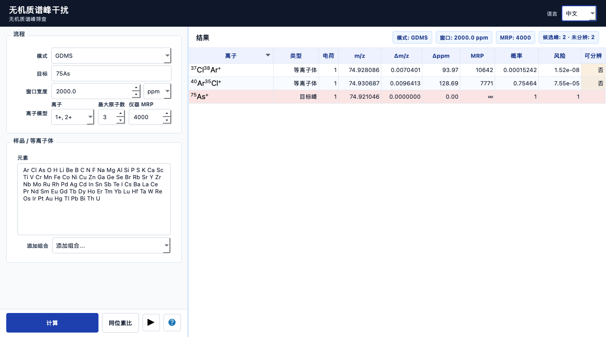

# Interference Calculator 2.0 图文用户手册

本手册面向 GDMS、ICP-MS、SIMS 等无机质谱峰干扰筛查场景。软件支持中文和英文界面，下面以中文界面为例。

## 1. 主界面


主界面分为三块：

- 顶部栏：显示软件名称，并提供语言切换。
- 左侧控制栏：设置工作模式、目标峰、窗口、元素列表、离子模型和仪器 MRP。
- 右侧结果区：显示结果概览、候选峰表格和空状态提示。

## 2. 选择语言

右上角的语言下拉框可在 `English` 和 `中文` 之间切换。切换后会同步更新：

- 主窗口标题和控件标签
- 表格表头
- 状态栏提示
- Help 软件介绍
- 谱图窗口标题和图例

## 3. 选择工作模式

左侧 `流程 / 模式` 中提供四种模式：

- `GDMS`：辉光放电质谱，默认窗口为 `2000 ppm`。
- `ICP-MS`：电感耦合等离子体质谱，默认窗口为 `400 ppm`。
- `SIMS`：二次离子质谱，默认窗口为 `200 ppm`。
- `通用扫描`：保留原始组合枚举逻辑，适合非专项筛查。

建议 GDMS 用户从 `GDMS` 模式开始。

## 4. 输入目标峰

在 `目标峰 / 目标` 中输入目标峰，可以是：

- 同位素形式：`75As`、`56Fe`
- 分子式形式：`40Ar35Cl`
- 数值形式：`74.9216`

如果目标峰没有显式电荷，软件会根据离子模型补充电荷并计算 m/z。

## 5. 设置 Window

`窗口宽度` 表示完整窗口宽度，而不是 `±` 半宽。

例如：

- 输入 `2000 ppm`
- 软件实际搜索目标峰两侧各 `1000 ppm`
- 谱图中目标峰位于中心

单位可以在 `ppm` 和 `m/z` 之间切换。只要目标峰有效，切换单位时软件会自动换算当前数值。

## 6. 输入元素列表

`样品 / 等离子体 / 元素` 是多行文本框，适合输入较长的元素列表。

推荐把以下元素都放进去：

- 待测元素
- 基体元素
- 等离子体元素，例如 `Ar`
- 常见背景元素，例如 `O H C N Cl S`
- 可能形成干扰的卤素或硫元素

示例：

```text
Ar Cl As O H
```

如果元素很多，可以换行输入；文本框支持自动换行和滚动。



## 7. 添加常用元素组合

`添加组合` 下拉框会把常用元素集合追加到元素输入框，不会覆盖已有内容。

常用组合包括：

- 全元素（无机质谱）：覆盖常见无机质谱可测元素，保留 Th/U，排除短寿命或非常规放射性元素，适合需要全面筛查时使用。
- Ar 等离子体背景
- 轻元素背景
- 卤素 / 硫
- 过渡金属基体
- 硅酸盐基体

## 8. 设置离子模型

`离子模型` 区域包含：

- `离子`：选择 `1+`、`1+, 2+`、`1+, 2+, 3+`、`1-` 或中性。
- `最大原子数`：控制候选分子或加合物的最大原子数。
- `仪器 MRP`：仪器质量分辨能力。

MRP 不改变候选峰生成范围。它只用于判断候选峰是否能与目标峰分辨，并在结果中标记为 `是` 或 `否`。

## 9. 计算干扰峰

点击 `计算` 后，结果表会显示：

- `离子`：候选离子或目标峰
- `类型`：原子离子、氧化物、等离子体加合物、背景分子等
- `电荷`
- `m/z`
- `Δm/z`
- `Δppm`
- `MRP`
- `概率`
- `风险`
- `可分辨`

结果上方的概览条会显示当前模式、窗口、MRP、候选峰数量和未分辨峰数量。

## 10. 判断结果

重点关注三列：

- `Δppm`：候选峰与目标峰的 ppm 偏差。
- `MRP`：分辨该干扰峰所需的质量分辨能力。
- `可分辨`：当前仪器 MRP 下是否能分辨。

如果 `可分辨` 为 `否`，说明该候选峰在当前仪器条件下可能与目标峰重叠，需要优先关注。

`风险` 是定性排序分数，用于筛查优先级，不是定量校正因子。

## 11. 查看谱图

点击谱图按钮可以打开目标峰居中的干扰谱图。


谱图逻辑：

- 目标峰位于中心。
- ppm 模式下横轴为 `Δppm`。
- 未分辨峰使用琥珀色高亮。
- 目标峰使用红色标记。
- 候选峰强度按相对风险或概率归一化显示。

## 12. 查看同位素比

点击 `同位素比` 可以查看当前元素的同位素丰度、比值、倒数比值和数据源。

该功能适合快速检查同位素组成，也可以用于确认数据库来源。

## 13. GDMS 推荐起步配置

```text
模式: GDMS
目标: 75As
窗口宽度: 2000 ppm
元素: Ar Cl As O H
离子: 1+, 2+
最大原子数: 3
仪器 MRP: 4000
```

这组参数会筛查 As 目标峰附近常见的 ArCl 等等离子体相关干扰。

## 14. 常见问题

### Window 为什么不是 ±？

因为很多仪器方法中设置的是完整窗口宽度。软件内部会自动把完整窗口换算为目标峰两侧的半宽。

### Instrument MRP 是否影响候选峰生成？

不影响。MRP 只影响结果中的可分辨判断和谱图高亮。

### 元素很多怎么办？

可以直接在多行元素框中换行输入。元素框支持滚动，适合全元素或长列表场景。

### 风险值能否用于定量校正？

不建议直接用于定量校正。`风险` 是筛查优先级分数，需要结合方法学和标准样品校准后才能用于定量模型。

## 15. Python 调用

```python
import interference_calculator as ic

data = ic.inorganic_interference(
    ['Ar', 'Cl', 'As', 'O', 'H'],
    '75As',
    charge=[1, 2],
    maxsize=3,
    risk_preset='gdms',
)
```

GUI 中的 ppm 完整窗口会换算为 API 所需的 m/z 半宽。直接调用 API 时，`targetrange` 仍然表示 m/z 半宽。
